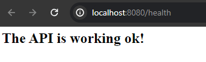
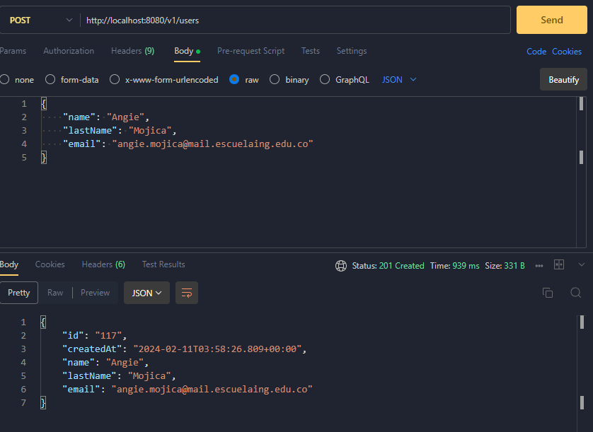
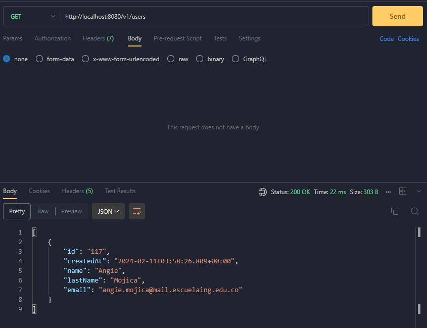
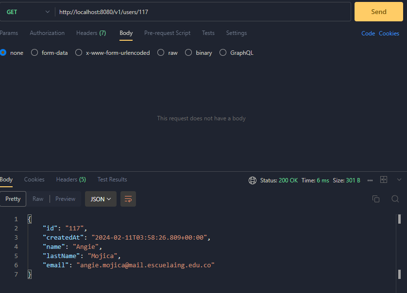
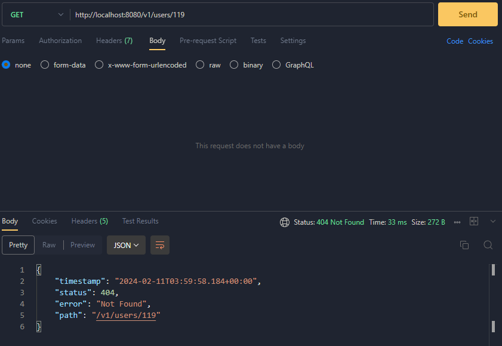
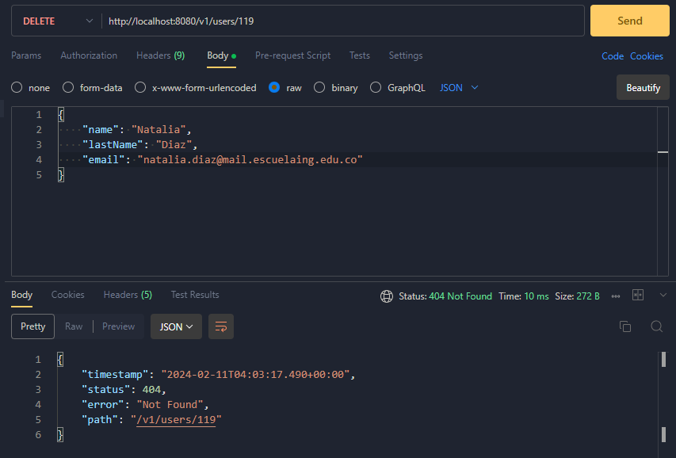
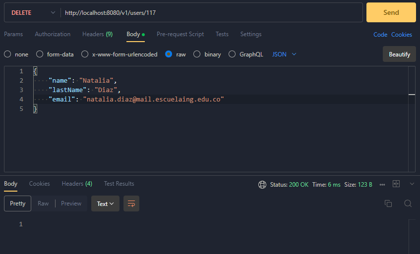
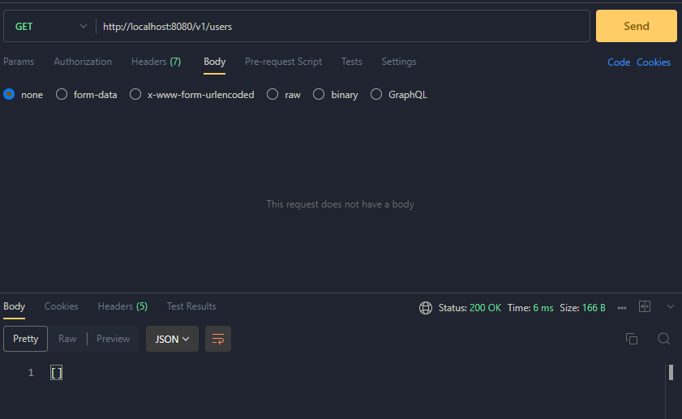

# IETI_Booking_System
## Proyecto de curso en IETI: Servicios Web RESTful con Java y Spring Boot

## Primera parte: Implementando mi primer servicio con Spring Boot y Java :smile:

Imagen que evidencia el funcionamiento de la aplicación: ✅

/

## Segunda parte: Implementando el controlador y servicio de API REST para la aplicación de reservas de laboratorios

Se realizó la implementación de los métodos de la API REST para la aplicación de reservas de laboratorios. Se implementaron los métodos de POST, GET, PUT y DELETE para la creación, consulta, actualización y eliminación de usuarios. A continuación se muestra el funcionamiento de cada uno de los métodos:

* 💡 Creación de un usuario:

* 🔍 Consulta de todos los usuarios:

* 🔍 Consulta de un usuario por su id:

* 🔍 Consulta de un usuario no existente:

* 🔄 Actualización de un usuario: 

* ⛔ Eliminación de un usuario no existente:

* ⛔ Eliminación de un usuario:

⛔ Prueba de que se elimino el usuario:

## Autor 🔆

* **Angie Natalia Mojica** [Perfin GitHub](https://www.linkedin.com/in/angienataliamojica/)